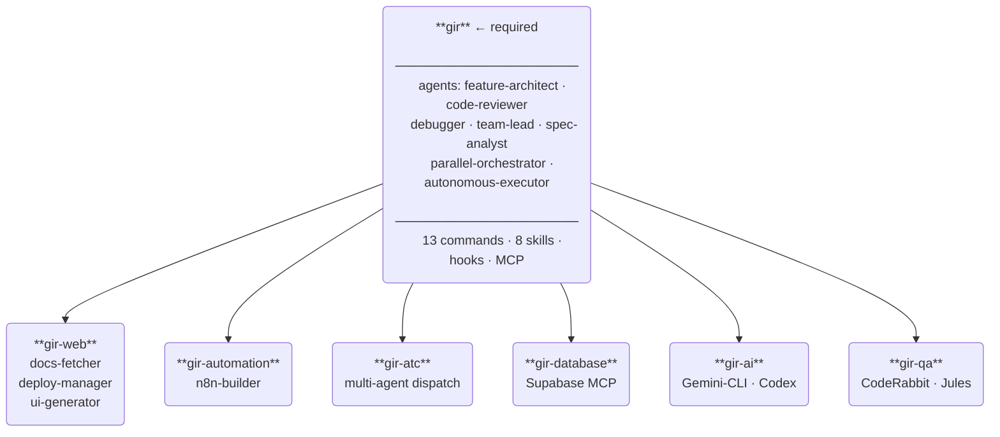
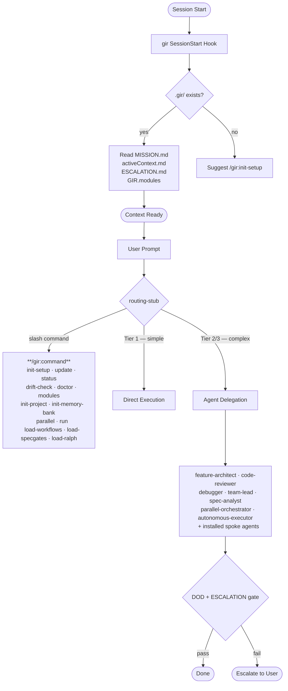

# GIR (Get It Running)
[](https://github.com/rivit-studio/GIR/stargazers)
[](https://github.com/rivit-studio/GIR/commits/main)
[](https://github.com/rivit-studio/GIR/issues)


[](https://github.com/rivit-studio/GIR/pulls)
[](LICENSE)

> A modular Claude Code plugin ecosystem. Install only what you need — curated agents, routing-stub orchestration, memory bank, and domain-specific tooling.
 
> **"[Doom Song](https://youtu.be/Nw_cdqQHGA8?si=wxLOA3FYWppVxnOF&t=3)!"**


## What Is GIR?

GIR is a modular ecosystem that separates:

- Universal workflows (all projects)
- Project-specific details (your stack)
- Modular agents (opt-in only)

Drop into any project for instant Claude Code productivity.


## Why Modular?

GIR is designed so you **only pay the token cost for what you use**. Install `gir`, then add only the spokes your project needs. No wasted context, no irrelevant tools loaded into every session.

| Setup | Token Savings vs. Monolithic |
|-------|------------------------------|
| Core only | **~45% reduction** |
| Core + 1 spoke | ~35–40% reduction |
| Core + 2–3 spokes | ~25–35% reduction |
| All 7 modules | Comparable total, but fully modular |

Each module self-registers at session start. Installed modules list their tools in `.gir/GIR.modules`. Uninstalled modules are invisible — zero token overhead.

---

## Architecture

GIR uses a **hub-and-spoke** model. `gir` is required and provides the foundation. Spoke plugins are optional and extend it for specific domains.



---

## How It Works

Every Claude Code session, GIR activates automatically, loads your project context, and routes tasks to the right agent.



---

## Features

### Native Parallel Agents — `/gir:parallel`

Run independent workstreams concurrently using Claude Code's built-in `Agent` tool with worktree isolation. No external CLI required.

```
/gir:parallel
```

GIR also detects natural language triggers and invokes parallel automatically:

> "parallelize this", "dispatch agents", "run these in parallel", "spawn agents for each module"

Each agent runs in an isolated git worktree — no file conflicts, full independence. Results are reviewed and DOD-gated before merge.

### Autonomous Execution — `/gir:run`

Execute the active plan in `MISSION.md` autonomously. GIR dispatches agents, monitors progress, checkpoints state, and resumes automatically after a usage-cap interruption — no human needed at each step.

```
/gir:run
```

**Usage-cap fail-safe:** GIR pre-schedules a resume agent at run start. If Claude hits a usage cap mid-run, the session resumes automatically when the next window opens — picking up from the last checkpoint.

**Unattended rules:** Confirmations are skipped. Escalation gates and DOD checks are **never** suppressed.

### GSD 2.0 Migration — `gir-migrate`

One-time plugin that converts GSD 2.0 project files (`.gsd/`) to GIR format (`.gir/`). Install, migrate, uninstall.

```bash
claude plugin install gir-migrate

# Preview first (nothing written to disk):
/gir-migrate:migrate-from-gsd --dry-run

# Run migration:
/gir-migrate:migrate-from-gsd

claude plugin uninstall gir-migrate
```

---

## Token Economics

GIR is designed for **zero wasted context**. You only load what you use.

| Setup | Context Used | Token Savings |
|-------|--------------|---------------|
| Core only | ~7-8K (3.5-4%) | 45% vs. monolithic |
| Core + 1 spoke | ~9-10K (4.5-5%) | 35-40% savings |
| Core + 2-3 spokes | ~11-14K (5-7%) | 25-35% savings |
| All modules | ~19-32K (10-16%) | Full modular ecosystem |

**What this means:** Installing just `gir` uses less than 4% of your 200K context window, leaving 193K+ tokens for your actual code and tasks. Each additional module adds only 2-4K tokens.

If you need a module, install it. If you don't, it costs nothing.

## Observability & Cost

Real usage numbers come from Claude Code itself — GIR never estimates token counts:

- **`/cost`** — token spend and cost for the current session
- **`/context`** — live context-window breakdown (see exactly what GIR's always-loaded skills cost you)
- **OpenTelemetry export** — set `CLAUDE_CODE_ENABLE_TELEMETRY=1` plus `OTEL_METRICS_EXPORTER` to ship usage metrics to your own dashboards (team FinOps)
- **`.gir/REVIEW-LOG.md`** — per-project audit trail: every dispatch logs agent count, models, duration, and retries

---

## Install

### Step 1: Add the marketplace

```bash
claude plugin marketplace add rivit-studio/GIR
```

### Step 2: Install core (required)

```bash
claude plugin install gir
```

### Step 3: Install the modules you need

```bash
claude plugin install gir-web           # Frontend/fullstack (v0, Figma, Vercel)
claude plugin install gir-automation    # n8n workflow automation
claude plugin install gir-atc            # Agentic traffic control — multi-agent coordination
claude plugin install gir-database      # Database management (Supabase)
claude plugin install gir-ai            # AI delegation (Gemini-CLI, Codex)
claude plugin install gir-qa            # QA & review (CodeRabbit, Jules)
```

### Step 4: Set up your project

```text
/gir:init-setup
```

Runs `/gir:init-project` (generates `CLAUDE-project.md`) and `/gir:init-memory-bank` (scaffolds `.gir/`) in one step.

### Step 5: Discover installed modules

```text
/gir:modules
```

---

## Quick Start by Tech Stack

### Next.js / React Fullstack

```bash
claude plugin install gir
claude plugin install gir-web         # Frontend tooling (v0, Figma, Vercel)
```

Then run `/gir:init-setup` to scaffold your project.

### Backend API

```bash
claude plugin install gir
```

Then run `/gir:init-setup` to scaffold your project.

### Full-Stack + Automation

```bash
claude plugin install gir
claude plugin install gir-web          # Frontend
claude plugin install gir-automation   # n8n workflows
```

Then run `/gir:init-setup` to scaffold your project.

### Data/ML Projects with Supabase

```bash
claude plugin install gir
claude plugin install gir-database     # Supabase tools
```

Then run `/gir:init-setup` to scaffold your project.

---

## Modules


| Module | Description | Includes | Who needs it |
|--------|-------------|----------|--------------|
| [gir](plugins/gir-core/) | Core hub. Agents, delegation, workflows, memory bank, slash commands | 7 agents, 8 skills, 13 commands, SessionStart hook, sequential-thinking MCP | Everyone |
| [gir-web](plugins/gir-web/) | Frontend and fullstack tooling — v0, Figma, Vercel | 3 agents, 3 skills, 5 MCP servers | Frontend/fullstack devs |
| [gir-automation](plugins/gir-automation/) | n8n workflow building | 1 agent, 1 skill, n8n MCP | Teams using n8n |
| [gir-atc](plugins/gir-atc/) | Agentic traffic control — multi-agent dispatch and coordination patterns | | Advanced multi-agent coordination |
| [gir-database](plugins/gir-database/) | Database management — Supabase | 1 skill, Supabase MCP | Projects using Supabase |
| [gir-ai](plugins/gir-ai/) | AI tool delegation — Gemini-CLI, Codex | 1 skill | Users with external AI tools |
| [gir-qa](plugins/gir-qa/) | QA & review tools — CodeRabbit, Jules | 1 skill, 2 MCP servers | Teams using automated code review |

### gir — Core Module Detail

**Agents (always available):**
| Agent | Role |
|-------|------|
| `feature-architect` | Feature design, spec writing, task decomposition |
| `code-reviewer` | Pre-commit review, quality gate enforcement |
| `debugger` | Root cause analysis, multi-system debugging |
| `team-lead` | Cross-agent coordination, project oversight |
| `spec-analyst` | Requirements analysis, clarity gate enforcement |
| `parallel-orchestrator` | Decomposes and dispatches parallel workstreams |
| `autonomous-executor` | Executes plans autonomously with checkpoint/resume |

**Commands:**
| Command | What it does |
|---------|-------------|
| `/gir:init-setup` | Full project setup — runs init-project + init-memory-bank |
| `/gir:init-project` | Generate `CLAUDE-project.md` for your stack |
| `/gir:init-memory-bank` | Scaffold `.gir/` memory bank (11 files) |
| `/gir:parallel` | Decompose and run independent tasks concurrently |
| `/gir:run` | Execute MISSION.md plan autonomously |
| `/gir:update` | Check for and apply GIR plugin updates |
| `/gir:status` | Show active context, current plan, installed modules |
| `/gir:modules` | List installed modules and their tools |
| `/gir:drift-check` | Detect stale references and doc drift |
| `/gir:doctor` | Deterministic ecosystem health check (manifests, versions, registry, memory bank) |
| `/gir:load-workflows` | Load workflows skill on demand |
| `/gir:load-specgates` | Load specgates skill on demand |
| `/gir:load-ralph` | Load ralph-loops skill on demand |

---

## What Stays in Your Project

GIR plugins install globally. Your project keeps its own configuration:

### Files You Own & Customize

- **`CLAUDE-project.md`** — **Edit this.** Your project-specific tech stack, dev commands, environment variables, conventions, and architectural decisions. This is the single source of truth for your project context. Create it by running:
  ```
  /gir:init-setup
  ```
  Then customize it for your stack.

### Memory Bank (Optional but Recommended)

Create `.gir/` for session-persistent patterns and decisions:

```
/gir:init-memory-bank
```

> **Note:** `.gir/` is added to `.gitignore` automatically — these files are local to your machine, not committed to version control.

Files GIR creates/manages here:

**Session state (auto-populated):**
- **`CLAUDE-activeContext.md`** — Current session state, goals, in-progress tasks
- **`CLAUDE-patterns.md`** — Code conventions (auto-populated by debugger)
- **`CLAUDE-decisions.md`** — Architecture choices (auto-populated by feature-architect)
- **`CLAUDE-troubleshooting.md`** — Known issues and solutions (auto-populated by debugger)
- **`CLAUDE-resources.md`** — External references and docs

**Policy and operations (customize these):**
- **`MISSION.md`** — Active priorities and autonomous run state
- **`ESCALATION.md`** — Must-escalate conditions for your project
- **`DOD.md`** — Definition of done checklist
- **`POLICY.md`** — Repo conventions (branching, commit style, testing rules)
- **`REVIEW-LOG.md`** — Review outcomes and audit trail
- **`ESCALATION-LOG.md`** — Escalation events with full context and timestamps

### Auto-Generated Registry

- **`.gir/GIR.modules`** — Auto-generated list of installed modules and their tools. Updated each session, never edit manually.

---

### Important: What NOT to Edit

GIR plugin files are **read-only in your project**. They live globally and are managed by the plugin system. Your `CLAUDE-project.md` tells them how to adapt to your project — you don't edit their files directly.

If you need to customize plugin behavior:
1. Add directives to `CLAUDE-project.md` under `[GIR CUSTOMIZATION]` section
2. Create custom agents in `.claude/agents/custom/` if needed
3. Use hook overrides (see module documentation)

---

## Updating Modules

### Check for updates

```text
/gir:update
```

Or via CLI:

```bash
claude plugin list
```

### Update a specific module

```bash
claude plugin upgrade gir-core
claude plugin upgrade gir-web    # Update specific modules
```

Or update all:

```bash
claude plugin upgrade-all
```

**What happens on update:**
- Module agents, skills, and commands are updated globally
- Your `CLAUDE-project.md` and `.gir/` files are never touched
- Memory bank files persist across updates
- Session hooks are refreshed with latest logic

---

## Upgrading from v2.2.0 or Earlier

Two plugins were renamed in v2.5.1. `claude plugin upgrade-all` won't catch these — the old plugin names become orphaned. Run the migration manually:

```bash
# Remove renamed plugins
claude plugin uninstall gir         # was the core hub
claude plugin uninstall gir-tools   # if you had it installed

# Install under new names
claude plugin install gir-core
claude plugin install gir-atc       # only if you had gir-tools

# Update everything else (version bumps only, names unchanged)
claude plugin upgrade-all
```

All other plugins (`gir-web`, `gir-automation`, `gir-database`, `gir-ai`, `gir-qa`, `gir-migrate`) upgrade normally with `upgrade-all`.

Your `.gir/` memory bank and project files are untouched by this process.

---

## Creating Custom Modules

Any Claude Code plugin can become a GIR module by including a `gir-module.json` manifest, a SessionStart hook for self-registration, and declaring `"requires": ["gir"]`. See [docs/decisions/2026-03-03-modularization.md](docs/decisions/2026-03-03-modularization.md) for the module contract ADR.

---

## Operating Model

How GIR works day-to-day (session-start, routing rules, Graphify gate, delegation tiers, completion gate, rule authority):

- **[docs/OPERATING-MODEL.md](docs/OPERATING-MODEL.md)** — Single reference for the live operating model
- **[docs/SETUP-STORY.md](docs/SETUP-STORY.md)** — Phase 0–8 bootstrapping arc with reusable prompt templates for new GIR installations

---


## FAQ

### How do I set up a new project with GIR?

1. Install `gir` globally: `claude plugin install gir`
2. Install any domain-specific modules you need (gir-web, gir-automation, etc.)
3. In your project, run `/gir:init-setup` to generate `CLAUDE-project.md` and scaffold `.gir/`
4. Start a Claude Code session — GIR auto-discovers your config

### What's the difference between gir and the spokes?

**gir** (required):
- 7 agents: feature-architect, code-reviewer, debugger, spec-analyst, team-lead, parallel-orchestrator, autonomous-executor
- 13 slash commands under `/gir:`
- Core workflows, delegation rules, memory bank system
- Session start hook

**Spokes** (optional, domain-specific):
- gir-web: v0, Figma, Vercel tools
- gir-automation: n8n builder
- gir-atc: Agentic traffic control — multi-agent dispatch and coordination
- gir-database: Supabase
- gir-ai: External AI tools (Gemini-CLI, Codex)
- gir-qa: Code review (CodeRabbit, Jules)

Install only what your project needs.

### How do I run tasks in parallel?

Two ways:

1. **Natural language** — just say it: "parallelize this", "run these in parallel", "dispatch agents for each module". GIR detects the intent and invokes `/gir:parallel` automatically.
2. **Explicit** — run `/gir:parallel` directly.

Each workstream runs in an isolated git worktree. No external CLI required.

### How does autonomous mode work?

Write your plan into `.gir/MISSION.md`, then run `/gir:run`. GIR reads the plan, dispatches agents phase by phase, checkpoints state before and after each action, and enforces DOD and ESCALATION gates throughout. Confirmations are skipped — but escalation is never suppressed.

If a usage cap interrupts the run, GIR resumes automatically when the next window opens.

### Which files in my project should I edit?

**Always edit:**
- `CLAUDE-project.md` — Your tech stack, commands, conventions

**Customize after `/gir:init-setup`:**
- `.gir/MISSION.md` — Set your active priorities for this session cycle
- `.gir/ESCALATION.md` — Adjust must-escalate thresholds for your project
- `.gir/DOD.md` — Adjust completion criteria for your project
- `.gir/POLICY.md` — Add project branching, commit, and testing conventions

**Let agents populate (or edit manually):**
- `.gir/CLAUDE-patterns.md` — Code patterns
- `.gir/CLAUDE-decisions.md` — Architecture decisions
- `.gir/CLAUDE-troubleshooting.md` — Known issues

**Never edit:**
- `.gir/GIR.modules` — Auto-generated, do not modify
- `.gir/ESCALATION-LOG.md` — Auto-appended on escalation events
- Plugin files (they're global, managed by the plugin system)

### How do I customize GIR for my project?

Edit `CLAUDE-project.md`. Add a `[GIR CUSTOMIZATION]` section with:
- Custom delegation rules (who handles what)
- Project-specific state machines
- Environment-specific behaviors
- Team-specific conventions

Example:
```markdown
## [GIR CUSTOMIZATION]

### Delegation Rules
- Database changes: Always review with DBA
- API changes: Feature-architect → code-reviewer → deploy

### State Machines
Feature states: Design → Development → Testing → Review → Deploy
```

### Can I work on multiple projects with different stacks?

Yes. Each project has its own `CLAUDE-project.md` and `.gir/` directory. GIR automatically uses the right configuration for each project. The plugins are global, but your project-specific settings keep them in sync.

### What if I don't need the memory bank?

It's optional. If you don't use it, GIR will function with just `CLAUDE-project.md`. Run `/gir:init-memory-bank` any time to add it later.

### Can I create custom agents?

Yes. Create `.claude/agents/custom/` in your project and add agent definitions there. Reference them in `CLAUDE-project.md` under `[GIR CUSTOMIZATION]`. See plugin documentation for the agent spec.

### How much token overhead does GIR add?

**Per session:**
- gir: ~3-4% of 200K context (7-8K tokens)
- Each additional module: ~1-2% (2-4K tokens)
- Total with all modules: ~10-16% (19-32K tokens)

This leaves ~188-193K tokens for your actual code and conversation. The modular design means you only pay for what you use.

### I have a GSD 2.0 project. Can I migrate to GIR?

Yes. Install the migration plugin, run it, then uninstall:

```bash
claude plugin install gir-migrate
/gir-migrate:migrate-from-gsd --dry-run   # preview first
/gir-migrate:migrate-from-gsd             # run migration
claude plugin uninstall gir-migrate
```

The dry run shows every file that would be written, what data maps where, what would be dropped and why, and an estimated completeness score. Nothing is written to disk until you confirm.

### What if a module has an issue?

1. Check the module's documentation in the marketplace
2. Open an issue: https://github.com/rivit-studio/GIR/issues
3. Temporarily disable the module: `claude plugin uninstall gir-<module>`
4. For Claude Code platform issues (not GIR-specific), use https://github.com/anthropics/claude-code/issues
5. For third-party module issues, file with that module's maintainer

---

## License

[MIT](LICENSE) — rivit-studio, 2026.
